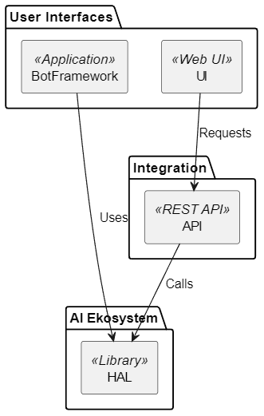

# HAL 
Your AI doesn't have to be evil to be smart. 
This is an AI toolkit enabling multiple AI tools to work together as one

## Environment
* Create a new conda environment for this project
* conda create -n hal python=3.13.3
* Use conda environment "hal": conda activate hal

### Packages
See each module for indivudal packages. 
Prioritize conda packages over pytthon if possible

### Uppgradering
* conda search python  
* conda install python=3.13.3

## Tools
* Llama Index - [LLM](https://www.llamaindex.ai/) 
* Ollama 
* VS Code extension Plant UML av jebbs

## Architecture

